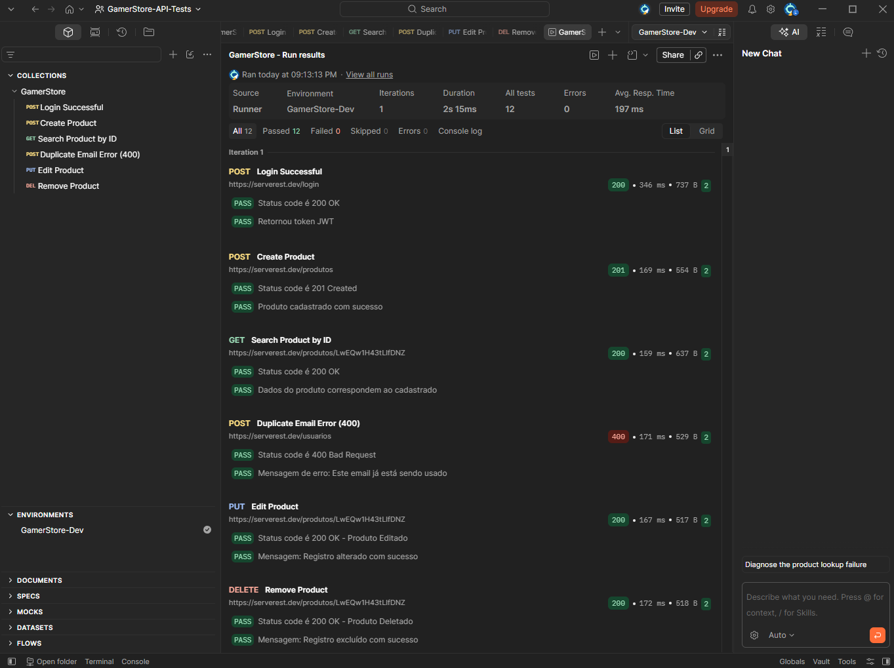

# 🎮 GamerStore - API Automation Suite (Postman & JS).

Este repositório contém a suíte de testes automatizados de API para o e-commerce **GamerStore**, cobrindo fluxos de autenticação JWT, gestão de produtos (CRUD completo) e cenários de exceção com tratamento de regras de negócio.

## 🚀 Tecnologias Utilizadas
* **Postman:** Criação de requisições e execução da suíte via Collection Runner.
* **JavaScript (ES6+):** Asserções de contrato, regras de negócio e validação de status codes.
* **JSON Schema / JWT:** Autenticação via Bearer Token e validação da estrutura do corpo da resposta.

## 🧪 Cobertura de Testes
| Método | Endpoint | Descrição / Objetivo | Status Esperado |
| :--- | :--- | :--- | :--- |
| **POST** | `/login` | Autenticação e extração dinâmica do Token JWT | 200 OK |
| **POST** | `/produtos` | Cadastro de novos produtos com validação de token | 201 Created |
| **GET** | `/produtos/{id}` | Busca de produto específico por variável de ID | 200 OK |
| **POST** | `/usuarios` | Cenário Negativo: Validação de e-mail duplicado | 400 Bad Request |
| **PUT** | `/produtos/{id}` | Atualização de dados do produto | 200 OK |
| **DELETE**| `/produtos/{id}` | Remoção do produto e limpeza de massa de dados | 200 OK |

## ⚙️ Diferenciais Técnicos
* **Request Chaining (Encadeamento de Requisições):** O token de autenticação gerado no login e o ID do produto criado são armazenados dinamicamente em variáveis de ambiente (`{{token}}` e `{{idProduto}}`) para reutilização nos testes subsequentes.
* **Teardown Automatizado:** Garantia da limpeza da base de dados através do script final `DELETE`.
* **SLA & Performance:** Validação de tempo de resposta em requisições críticas.

## 📊 Execução da Collection (Runner)


## 📁 Como Executar o Projeto

1. Clone este repositório:
   ```bash
   git clone https://github.com/LeonardoFernandino/gamerstore-api-postman.git
   ```
2. Abra o **Postman**.
3. Importe a Collection `GamerStore.postman_collection.json`.
4. Importe o arquivo de Environment (caso tenha exportado).
5. Execute a suíte através do **Collection Runner**.
